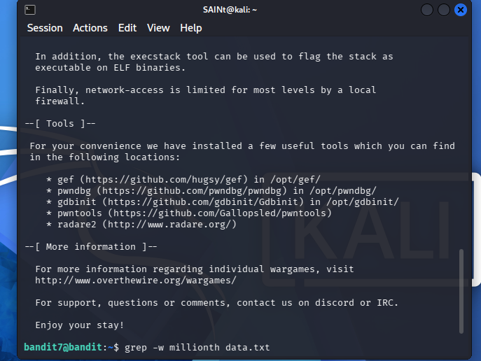
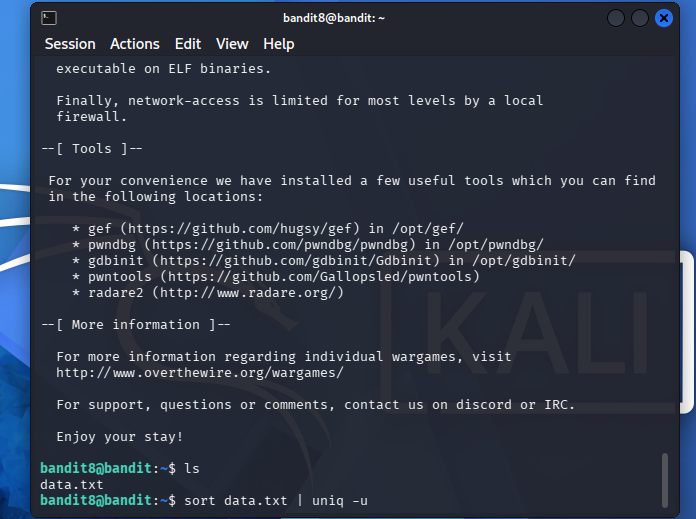
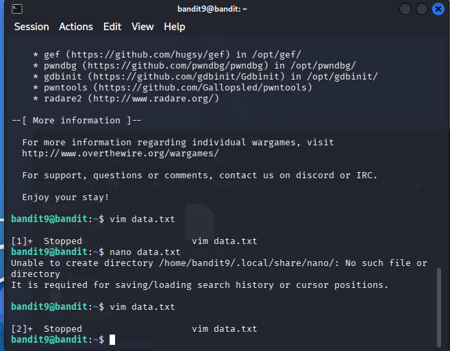
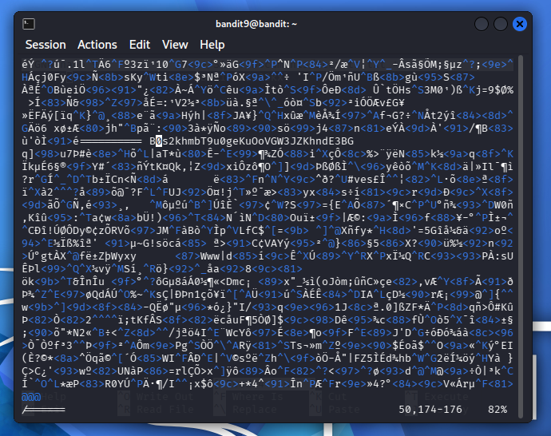
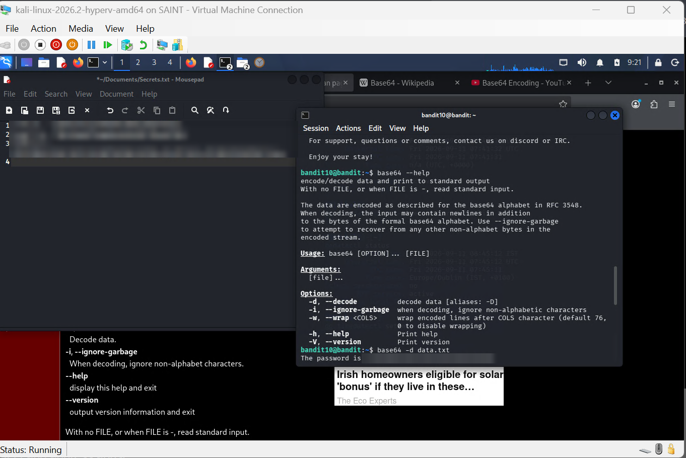

 

### Walkthrough

Level 0: accessed port 2220 on bandit.labs.overthewire.org through a -p flag

Level 0-1: accessed a file called readme present in the home directory

Level 1-2: used the password in the readme file present in level 1 before using the cat command to access the "-" file in level 2 through use of full directory specification.

Level 2-3: Used the password in the "-" file present in level 2 before using the cat command to access the "-- spaces in this filename--"

file in level 3 through the use of single quotes to specify directory.

Level 3-4: Used the password in the "--spaces in this filename--" file in level 3 before using the cat command to access the ".inhere" file in level 4 through the use of a dot in front of the filename to specify hidden directories.

Level 4-5: Used the password present in the ".inhere" file in level 4 before using the the cat command to access the only human readable file through the use of manual inspection.

Level 5-6: Used the password found through manual inspection in level 5 before conducting a manual inspection across all files in the inhere directory, navigating directly from home directory rather than directory specific naviagtion to the files, when that failed, an online research was conducted which revealed the presence of the file as a hidden file in one of the subdirectories present within the inhere directory, using the "find /inhere -type f -size 1033 ! executable" command to satisfy the conditions required to find the specific file in question.

Level 6-7: Used the find command to search the root directory for a file that had user bandit7, group bandit6 and a size of 33 bytes. was initially using plain 33 to search, after revisiting the command that worked in level 5-6, i discovered there was a c omission at the end of the 33 bytes size specification, leading to only processes and runs that i had insufficient privilege to access being displayed.

Level 7-8: After authentication to level 7, used ls in default directory to list set of available files, discovered data.txt. used vim data.txt to open file, then pressed / key to search for the millionth text, screenshoted the text through native window application, pasted on an AI system to generate the text from the image, after pasting, it failed, tried manual translation from image directly to terminal, also failed, used grep -w millionth data.txt, generated the line, copied the generated line and pasted it into level 8's SSH authentication, it worked.

Level 8-9: After logging in to the 8th level, i ran an ls command to list available files and directories in the default path, through the use of the sort command which arranges and groups all duplicate texts in the document, i then piped the output of the sort command into a uniq command with the -u flag to generate the unique output in the text.

Level 9-10: After logging in to the 9th level, i ran an ls command to list the active directories and files present in the server. i found just data.txt. i ran a vim data.txt, then i used the / symbol to manually specify the "=====" that prepended the password string, i found various text that justified this condition, but just one that listed an actual password.

Level 10-11: This level required base64 file decoding, making use of the -d flag to decode the data.txt file present in the default directory, leading to knowledge of the next level's password.

